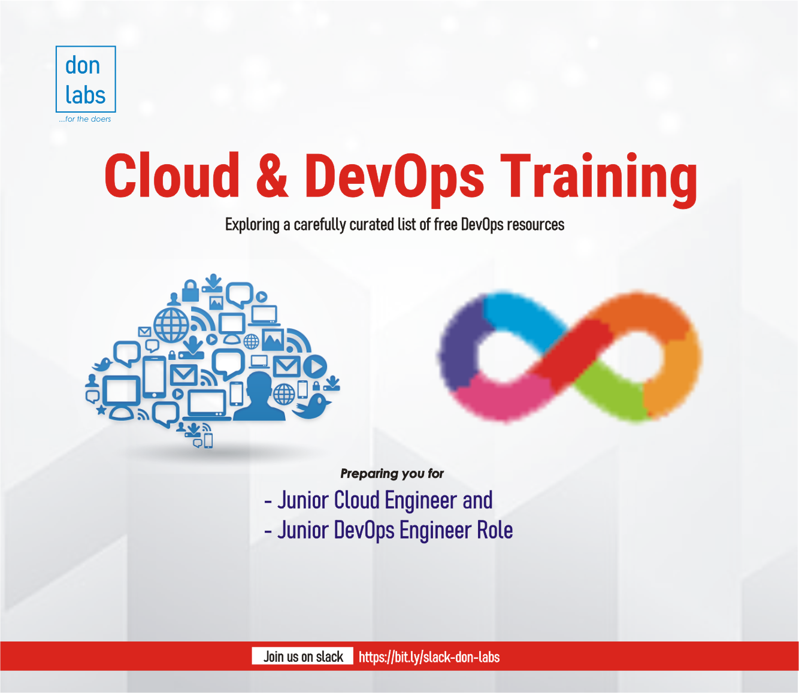

# Welcome to DON LABS program

I am glad you are here to learn about cloud computing and DevOps. Our mission is to provide you with an evolving project that serves as a comprehensive guide while exploring free, valuable resources on these subjects. Here, you will find a wealth of information, including tutorials, exercises, and hands-on projects to aid in your learning journey. For more detailed information, kindly refer to the menu bar - free self-paced.

If you prefer a collaborative and interactive learning experience, we are thrilled to offer a premium study-group for beginners. Within this group, you will join motivated peers like yourself, working together to overcome challenges and obstacles. Additionally, you will have the opportunity to build a professional portfolio, participate in active recall sessions, and prepare for AWS exams within a span of 3 months. For more detailed information, kindly refer to the menu bar - premium study-group.

By the end of this program, you will be able to:

- Understand the basics of cloud computing and DevOps
- Implement cloud computing and DevOps solutions to solve real-world problems
- Build a portfolio of cloud and DevOps projects
- Prepare for the AWS certification exam
- In addition to the final project, you will also complete weekly hands-on projects that will help you solidify your learning.

I hope you enjoy learning with us!
  
## Join the community on Slack;
- [Slack](https://bit.ly/slack-don-labs)

### Final Project
- Application: e-commerce-microservices app
- Credit: Venkata Ravuri @venkataravuri

This is the architecture of the final project;

### Next Individual Challenge
- Application: train-ticket app
- Credit: FudanSELab

This is the architecture of next individual challenge;

As a community member, are you ready to be recognized as one of our community's most valued heroes? Your dedication and passion can propel you to greatness! We're excited to extend an exclusive invitation to join the prestigious "Don Circle" list - a league of extraordinary volunteers who make a real impact!
🤝 Why Choose the Don Circle?
At don labs, we believe in celebrating those who lead by example. As a Don Circle elite, you'll experience:
🌱 Empowerment: Empower lives and uplift the community through your selfless service.
💡 Growth: Unlock new skills, hone your talents, and grow both personally and professionally.
🏆 Recognition: Be applauded and celebrated for your outstanding contributions on our Don Circle list. Check the list of the community don from the the Don Circle menu.
🎓 Learning: Engage in exciting weekly activities that foster continuous learning and innovation.

🚀 How to Secure Your Spot in the Don Circle:
Joining the Don Circle is easier than ever! Follow these simple steps to claim your spot among our community's finest volunteers:
* 1. Completion and Hosting: Successfully complete the week's project and host it on your public GitHub Account, ensuring you follow the appropriate steps for each task.
* 2. Share Your Progress: Capture a screenshot of the completed project as it appears on your GitHub repo and share it with our vibrant community.
* 3. Dedication Display: Demonstrate your unwavering commitment and dedication throughout the weekly activities.
* 4. Bask in Recognition: Witness your name shining brightly on the esteemed Don Circle list, where we celebrate exceptional volunteers like you!
Together, let's make a significant impact and inspire others to reach for greatness. The Don Circle awaits your remarkable contributions!
If you have any questions or need assistance, feel free to contact us.
🌟 Be part of something extraordinary - join the Don Circle today! 🌟

👉 Your Community Needs You!
Your involvement is what propels us towards greatness. Together, we can create a ripple effect of positive change!
📅 Note that for each week, the first three best projects that meet up with be the above criteria will be considered for projects presentation and eventual making it to Don Circle list. Don't miss this exclusive opportunity. Spaces are limited, so act swiftly!
Together, let's write a remarkable journey of service and impact within our community!
Warmest regards,
Adeolu Oyinlola

## About Content Curator

Adeolu Oyinlola

- DevOps Engineer | AWS Community Builder | LiFT Scholar 2023

- [GitHub](https://github.com/deoluoyinlola/do-devops-projects)

- [LinkedIn](https://www.linkedin.com/in/deoluoyinlola/)

- [Twitter](https://twitter.com/deoluoyinlola)

