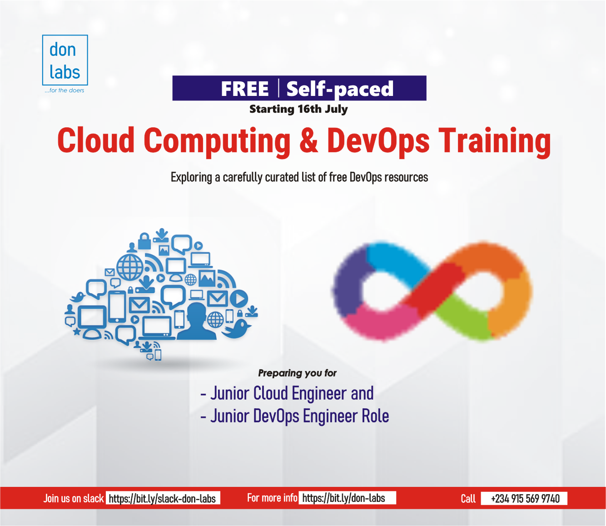

# Introduction to this free courses

Weekly Resource Schedule

To make it easier to navigate and manage your learning, we have divided all of the resource materials into 8 weeks. Each week will focus on 2-3 key subjects. The program is intentionally designed for self-paced learning to allow participants the flexibility to learn at their own pace. However, to promote organization and foster a sense of accountability, an optional timeframe of 8 weeks has been introduced. Participants are encouraged to utilize this timeframe as a guideline, but they are also free to adapt it according to their individual preferences and learning needs.

Here is a breakdown of the weekly schedule:

Week 1

- Introduction to DevOps
- Introduction to Cloud Computing
- Version Control System

Week 2

- Linux
- Scripting

Week 3

- Security
- Database

Week 4

- AWS Fundamentals
- Network

Week 5

- Container
- Container Orchestration

Week 6

- Infrastructure as a code

Week 7

- Continuous Integration and Continuous Delivery (CI/CD)

Week 8

- Final Project

## Note:

You don't need to use all of the resources we have listed for each week.
We recommend picking 1-2 tutorial videos that resonate with you and doing as many hands-on projects as possible.
You can always fall back to the other materials after this program.

Each week, we will focus on a specific subject to deepen our understanding and expertise. This concentrated approach will allow us to explore the intricacies of the chosen subject and make significant progress in our learning journey. Let's embrace this opportunity to delve into the subject matter and expand our knowledge base. Together, we will make each week a stepping stone towards excellence.

I hope this is helpful!

